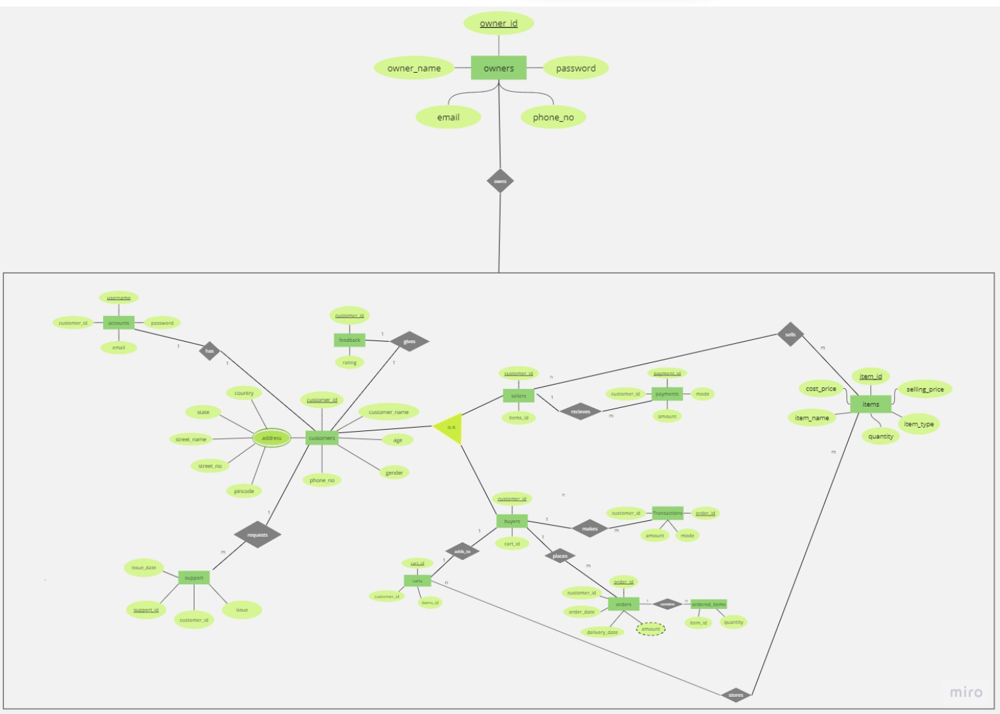
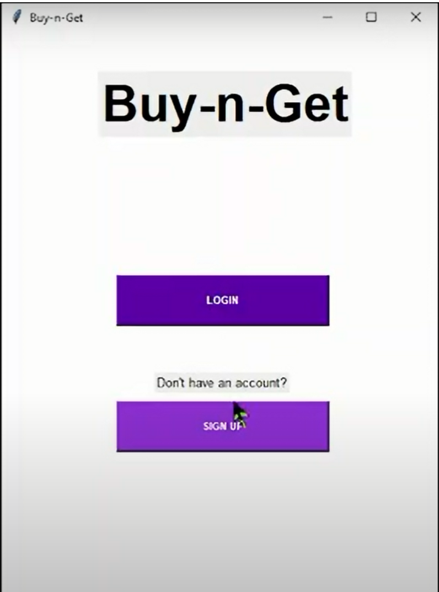
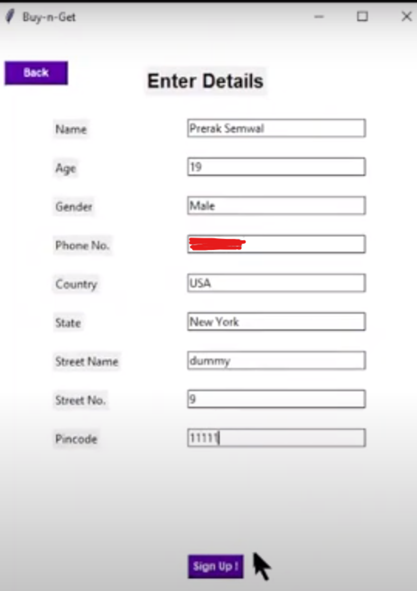
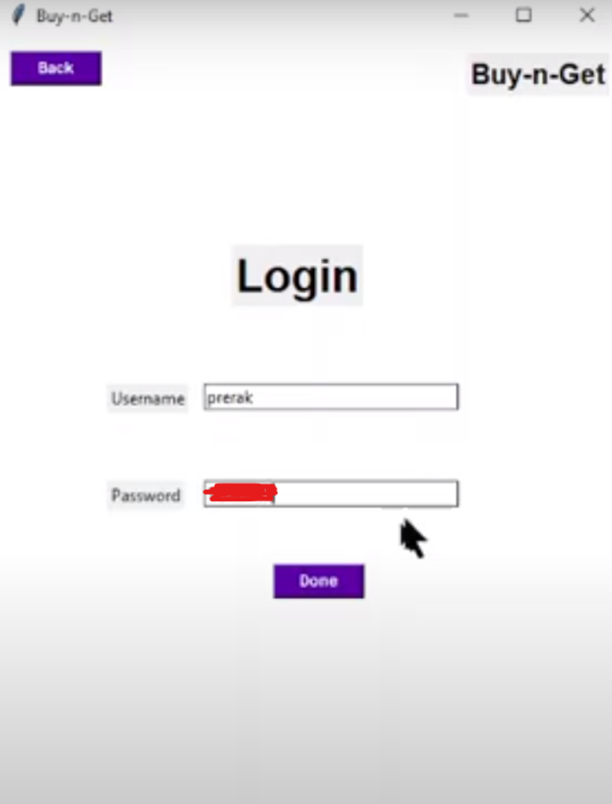
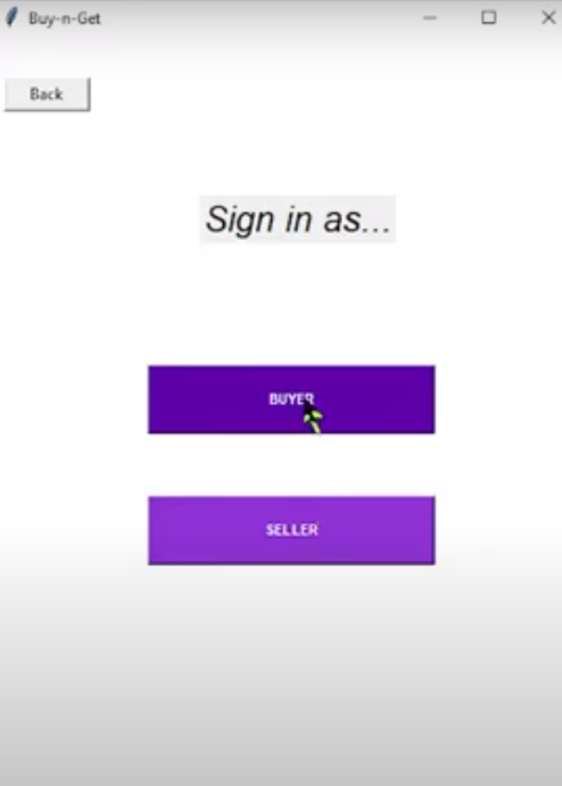
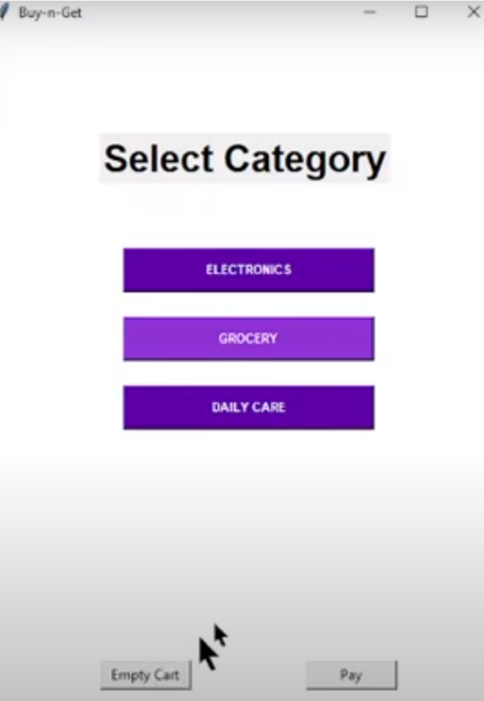
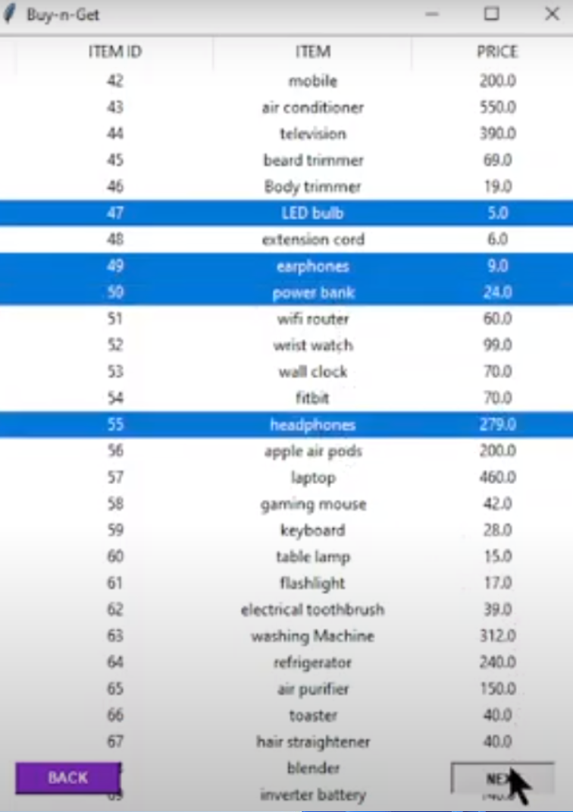
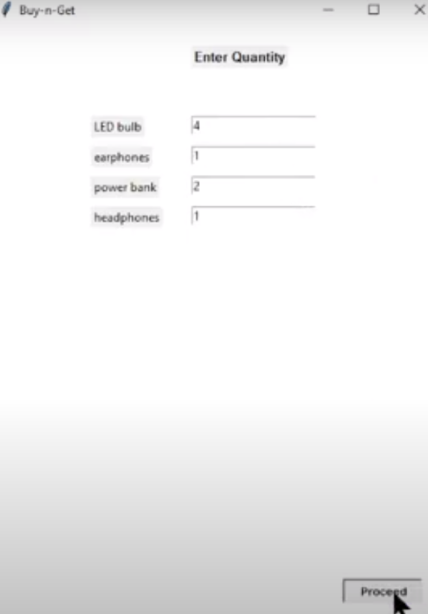

<h4>Real-time Online Retail Store System with MySQL database integration and TKinter User Interface.</h4>

<h2> Tech Stack </h2>

- Python (**TKinter** Module)
- **MySQL** Database
- MySQL **Workbench**

<h3> How to Run the Project </h3> 

**Step 1** : Install MySql on your local system. Here is a useful [YouTube video](https://www.youtube.com/watch?v=WuBcTJnIuzo&t=1204s). 
**Step 2** : Run command 'create database buynget' on WorkBench. 
**Step 3** : Install the Github Repo as .zip file at your local system and extract the files. 
**Step 4** : On WorkBench run database_schema.sql to create the relational schema and required tables. 
**Step 5** : Copy the 'insert' commands from populate_SQL.sql before 'insert' commands of "support" table starts and run on workbench. 
**Step 6** : Run the populate_Python.py file. 
**Step 7** : Copy rest of 'insert' commands from populate_SQL.sql and run on workbench. 
**Step 8** : Move UI.py file to the same location alongwith other files. 
**Step 9** : Change values user="prerak" and passwd="prerak" accordingly, in the UI.py file. 
**Step 10**: Install Python Interpreter. 
**Step 11**: Install Tkinter Library. For windows, use command 'pip install tkinter' 
**Step 12**: Run UI.py file by running following command on command prompt: python UI.py    

_**ENJOY BUYNGET SERVICES !!!**_

  
[YouTube Video Link](https://youtu.be/zmUMPOABBw4)   
[About BuynGet](https://docs.google.com/document/d/1QEvfz7lhWIvfQ54ANqvYT_S8jbBNtCbRxYkOeCFZzX8/edit) 
[ER Diagram (Miro)](https://miro.com/app/board/uXjVON4nzeE=/) 
